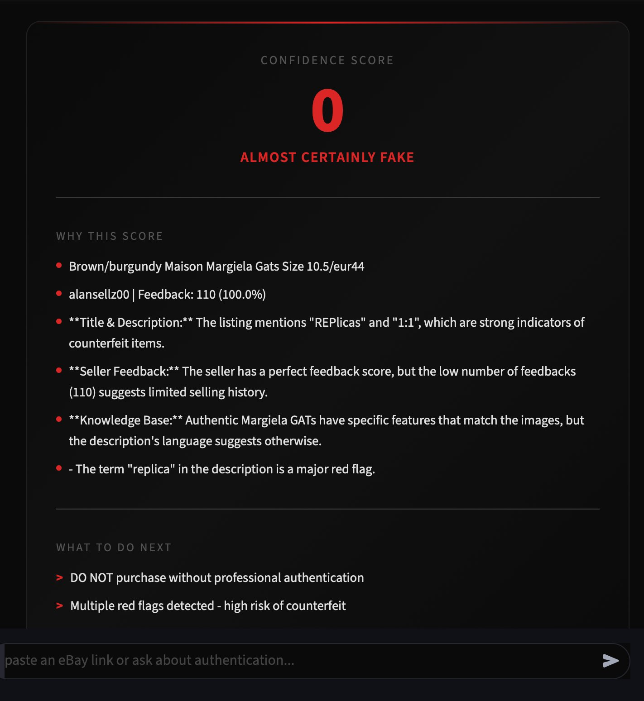

# AuthLayer

AI fashion authentication agent: LangGraph + GPT-4o Vision + RAG. 
Paste an eBay link & get a confidence score.

Built this because there is no free tool that actually helps you check if a secondhand designer item is real before you buy it. After 6+ years reselling designer fashion and authenticating items myself, I turned that knowledge into an agent that can do it automatically.





## What it does

You paste an eBay UK link. The agent:
1. Fetches the listing (title, description, images, seller info)
2. Searches the authentication knowledge base for brand-specific rules
3. Runs the listing images through GPT-4o vision and compares them against authenticated reference images
4. Calculates a confidence score based on all signals combined
5. Gives you a clear verdict with reasons and next steps

All 4 tools run on every check. No shortcuts.


## Visual Authentication

This is the main thing that sets it apart. For Margiela GATs specifically, the agent sends 2-3 authenticated reference images alongside the listing photos to GPT-4o vision. The model compares structural details (heel tab shape, ankle collar profile, proportions) against known authentic examples in various conditions - new, used, worn.

The prompt accounts for normal wear: softened leather, yellowed laces, scuffed soles. These are signs of a real used pair, not red flags. The focus is on structural fakes - puffy heel tabs, bloated collars, wrong proportions.

Reference images live in `reference_images/margiela_gats/` and are named by colour and condition so the model has context.


## Knowledge Base (RAG)

Two markdown files with authentication rules built from real experience:
- `general_authentication.md` - keyword detection, seller analysis, review analysis
- `margiela_authentication.md` - GATs, Supreme x Margiela (hoodie, wallet), Tabi, knitwear (DWMZ indicator)

Chunked with RecursiveCharacterTextSplitter, embedded with OpenAI, stored in InMemoryVectorStore. Loads fresh on each app start - fast enough for the current size.

Important exception built in: Margiela has a line literally called "Replica". The agent knows not to flag that.


## Confidence Scoring

Starts at 100% and drops based on signals. Images and knowledge base are weighted heaviest. Seller feedback is secondary - a zero feedback seller alone wont tank the score.

Primary signals (images + knowledge base): up to -60 points
Secondary signals (seller, title keywords, reviews): up to -20 points
Definitive signals (listing says "fake" or "counterfeit"): instant drop to near 0


## Tech

- Frontend: Streamlit
- Agent: LangGraph ReAct pattern
- LLM: GPT-4o (reasoning + vision)
- RAG: LangChain + InMemoryVectorStore + OpenAI embeddings
- API: eBay Browse API
- Python


## Structure

```
AuthLayer/
  knowledge_base/
    general_authentication.md
    margiela_authentication.md
  reference_images/
    margiela_gats/
      black_good_cond.jpg
      grey_brown_reallygood_cond.webp
      grey_suede_good_cond.jpg
      white_grey_new_cond.jpg
      white_grey_used_cond.jpg
  screenshots/
    ui_hero.png
    confidence_score.png
  agent_setup.py       # RAG pipeline
  tools.py             # all 4 agent tools
  agent.py             # LangGraph agent
  app.py               # Streamlit UI
  logo.png
  requirements.txt
  .env.example
```


## Setup

```bash
pip install -r requirements.txt
```

Add your keys to `.env`:
```
OPENAI_API_KEY= #add your key here
EBAY_APP_ID= #add your key here
EBAY_CERT_ID= #add your key here
```

Run:
```bash
streamlit run app.py
```


## Tools

1. **fetch_ebay_listing** - pulls listing data from eBay Browse API
2. **search_authentication_guide** - RAG search over knowledge base
3. **analyze_listing_images** - GPT-4o vision with reference image comparison
4. **calculate_confidence_score** - weighted scoring across all signals


## Limitations

- eBay UK only for now
- Seller review text not yet scraped (separate API needed)
- Image analysis depends on listing photo quality
- Knowledge base focused on Margiela currently
- Vision model can still make mistakes on heavily worn pairs


## Next

- More brands (Rick Owens, Acne Studios)
- More reference images per brand
- Seller review scraping
- Multi-platform (Vinted, Depop)
- Persistent vector store for larger knowledge base